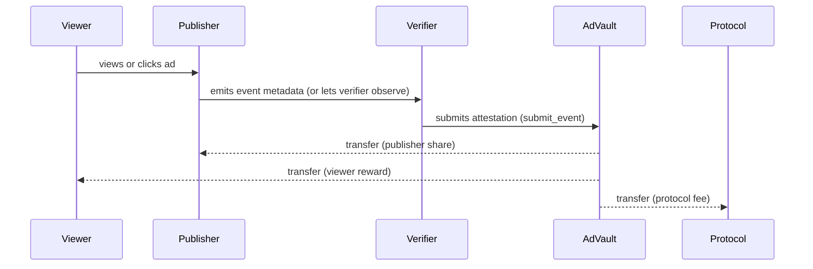

# Adescentralized – Smart Contracts (Stellar Blockchain)

**A Soroban-powered smart contract ecosystem that enables transparent, decentralized advertising with automated revenue distribution and fraud prevention.**

> Part of the **Adescentralized** ecosystem — a Stellar‑powered, privacy‑first advertising platform with on‑chain verification and fair payouts to advertisers, publishers, and users.

---

## 0) Introduction & Context

Adescentralized revolutionizes digital advertising by leveraging **Stellar blockchain** and **Soroban smart contracts** to create a transparent, fraud-resistant ecosystem where:

* **Advertisers** create campaigns with guaranteed budget control and pay only for verified interactions.
* **Publishers** integrate ads into their platforms and receive automatic, transparent revenue splits.
* **Users** interact with ads and receive **real XLM rewards** directly to their wallets.
* **Verifiers** act as trusted oracles that validate ad interactions and trigger payments.

This repository contains the **core smart contracts** that power the decentralized advertising protocol, handling campaign management, payment distribution, and fraud prevention.

---

## 1) System Architecture

### 1.1 Smart Contract Components

1. **AdVault Contract** (`advault/`) – Core campaign management and payment distribution
2. **VerifierRegistry Contract** (`verifier_registry/`) – Authorization system for verifiers and publishers
3. **Stellar Asset Integration** – Native XLM/USDC token handling via Stellar Asset Contracts

### 1.2 Actors & Roles

* **Admin**: Protocol administrator with governance capabilities
* **Advertisers**: Create campaigns and fund ad budgets
* **Publishers**: Host ads and receive revenue share
* **Viewers/Users**: Interact with ads and earn rewards
* **Verifiers**: Trusted oracles that validate interactions and trigger payments

### 1.3 High‑Level Smart Contract Flow

```mermaid
flowchart LR
  subgraph Actors
    A[Advertiser]
    P[Publisher]
    V[Viewer]
  end

  A -->|1. Create campaign\n2. Fund budget| AdVault[AdVault Contract]
  P -->|2. Display ad content| AdVault
  V -->|3. Interact (click/view)| AdVault

  AdVault -->|Request verification| Verifier[Verifier (Oracle)]
  Verifier -->|Validate & trigger payment| AdVault

  AdVault -->|Distribute payments| P
  AdVault -->|Distribute reward| V
  AdVault -->|Collect protocol fee| Admin[Protocol / Admin]

  classDef contract fill:#f3f4f6,stroke:#111827,stroke-width:1px;
  class AdVault,Verifier contract;
```

### 1.4 Payment Distribution Flow



---

## 2) Smart Contract Features

### 2.1 AdVault Contract (`advault/`)

**Core advertising campaign and payment management contract**

#### Campaign Management
* **Create Campaign**: Advertisers create campaigns with unique IDs and initial budgets
* **Fund Campaigns**: Add additional funds to existing active campaigns
* **Close Campaigns**: Admin can close campaigns and trigger refunds
* **Budget Control**: Automatic spending tracking and insufficient fund protection

#### Payment Distribution System
* **Configurable Revenue Splits**: Customizable percentage splits for publishers, viewers, and protocol
* **Instant Payments**: Automatic token transfers upon verified interactions
* **Anti-Replay Protection**: Prevents duplicate event submissions
* **Event Tracking**: Comprehensive logging of all interactions and payments

#### Governance & Security
* **Pause/Unpause Protocol**: Emergency stop functionality
* **Admin Controls**: Price adjustments, split modifications, fee changes
* **Access Control**: Integration with VerifierRegistry for authorization
* **Fraud Prevention**: Event validation and replay attack protection

### 2.2 VerifierRegistry Contract (`verifier_registry/`)

**Authorization and access control system**

#### Verifier Management
* **Add/Remove Verifiers**: Admin can authorize trusted oracle services
* **Verifier Status Check**: Public verification of authorized verifiers
* **Decentralized Trust**: Multiple verifier support for redundancy

#### Publisher Management
* **Publisher Allowlist**: Control which publishers can participate
* **Status Management**: Enable/disable publisher access
* **Compliance Tools**: Maintain platform quality and standards

---

## 3) Tech Stack

* **Blockchain**: Stellar Network (Testnet/Mainnet)
* **Smart Contracts**: Soroban SDK v21
* **Language**: Rust 2021 Edition
* **Token Standard**: Stellar Asset Contracts (Native XLM, USDC)
* **Build System**: Cargo workspace with multi-contract support

---

## 4) Project Structure

```
stellar-ads/
├─ Cargo.toml                    # Workspace configuration
├─ README.md                     # Soroban project documentation
├─ advault/                      # Core advertising contract
│  ├─ Cargo.toml
│  └─ src/
│     └─ lib.rs                  # AdVault contract implementation
├─ verifier_registry/            # Authorization contract
│  ├─ Cargo.toml
│  └─ src/
│     └─ lib.rs                  # VerifierRegistry implementation
├─ test_advault.sh              # Comprehensive contract testing
├─ test_advault_simple.sh       # Simplified testing script
├─ test_payment_distribution.sh # Payment flow demonstration
└─ target/                      # Compiled contract artifacts
```

---

## 5) Getting Started

### 5.1 Prerequisites

* **Rust 1.70+** with `wasm32-unknown-unknown` target
* **Stellar CLI** (`stellar`) installed and configured
* **Soroban SDK v21** (included in dependencies)
* **Stellar testnet/mainnet accounts** (admin, advertiser, publisher, viewer, verifier)

### 5.2 Installation

```bash
# Clone the repository
git clone <repository-url>
cd Adescentralized-Contracts/stellar-ads

# Install Rust target for WebAssembly
rustup target add wasm32-unknown-unknown

# Build all contracts
cargo build --target wasm32-unknown-unknown --release

# Build specific contract
cd advault
cargo build --target wasm32-unknown-unknown --release
```

### 5.3 Deploy Contracts

```bash
# Deploy AdVault contract
stellar contract deploy \
  --wasm target/wasm32-unknown-unknown/release/advault.wasm \
  --network testnet \
  --source admin

# Deploy VerifierRegistry contract  
stellar contract deploy \
  --wasm target/wasm32-unknown-unknown/release/verifier_registry.wasm \
  --network testnet \
  --source admin
```

### 5.4 Initialize Contracts

```bash
# Initialize VerifierRegistry
stellar contract invoke \
  --id <VERIFIER_REGISTRY_CONTRACT_ID> \
  --network testnet \
  --source admin \
  -- init \
  --owner admin

# Initialize AdVault
stellar contract invoke \
  --id <ADVAULT_CONTRACT_ID> \
  --network testnet \
  --source admin \
  -- init \
  --admin admin \
  --token <TOKEN_CONTRACT_ADDRESS> \
  --verifier_registry <VERIFIER_REGISTRY_ADDRESS> \
  --price_per_event 10000000 \
  --split_publisher_bps 6000 \
  --split_viewer_bps 3000 \
  --fee_bps 1000
```

---

## 6) Contract APIs

### 6.1 AdVault Contract Methods

#### Campaign Management
```bash
# Create campaign
stellar contract invoke --id <CONTRACT> -- create_campaign \
  --campaign_id <32_BYTE_ID> \
  --advertiser <ADDRESS> \
  --initial_deposit <AMOUNT>

# Add funds to campaign
stellar contract invoke --id <CONTRACT> -- deposit \
  --campaign_id <32_BYTE_ID> \
  --from <ADDRESS> \
  --amount <AMOUNT>

# Get campaign details
stellar contract invoke --id <CONTRACT> -- get_campaign \
  --campaign_id <32_BYTE_ID>
```

#### Payment Processing
```bash
# Submit verified event (called by verifier)
stellar contract invoke --id <CONTRACT> -- submit_event \
  --att <ATTESTATION_STRUCT> \
  --verifier <VERIFIER_ADDRESS>
```

#### Administrative Functions
```bash
# Pause/unpause protocol
stellar contract invoke --id <CONTRACT> -- pause_protocol
stellar contract invoke --id <CONTRACT> -- unpause_protocol

# Update configuration
stellar contract invoke --id <CONTRACT> -- set_price_per_event \
  --new_price <AMOUNT>

stellar contract invoke --id <CONTRACT> -- set_splits \
  --pub_bps <BASIS_POINTS> \
  --view_bps <BASIS_POINTS>
```

### 6.2 VerifierRegistry Contract Methods

```bash
# Add authorized verifier
stellar contract invoke --id <CONTRACT> -- add_verifier \
  --v <VERIFIER_ADDRESS>

# Check verifier status
stellar contract invoke --id <CONTRACT> -- is_verifier \
  --v <VERIFIER_ADDRESS>

# Manage publisher status
stellar contract invoke --id <CONTRACT> -- set_publisher_status \
  --p <PUBLISHER_ADDRESS> \
  --allowed true
```

---

## 7) Testing & Validation

### 7.1 Automated Testing Scripts

**Comprehensive Testing:**
```bash
chmod +x test_advault.sh
./test_advault.sh
```

**Simplified Testing:**
```bash
chmod +x test_advault_simple.sh
./test_advault_simple.sh
```

**Payment Distribution Demo:**
```bash
chmod +x test_payment_distribution.sh
./test_payment_distribution.sh
```

### 7.2 Test Coverage

The test scripts verify:
* ✅ Contract initialization and configuration
* ✅ Campaign creation and funding
* ✅ Payment distribution mechanics
* ✅ Administrative functions (pause/unpause, parameter updates)
* ✅ Anti-fraud mechanisms (replay protection)
* ✅ Access control and authorization
* ✅ Error handling and edge cases

### 7.3 Manual Testing Checklist

* [ ] Deploy contracts successfully
* [ ] Initialize with proper parameters
* [ ] Create campaigns with different advertisers
* [ ] Process payment events with correct splits
* [ ] Test pause/unpause functionality
* [ ] Verify anti-replay protection
* [ ] Check access control enforcement
* [ ] Validate refund mechanisms

---

## 8) Configuration & Parameters

### 8.1 Default Configuration

```rust
// Payment Distribution (Basis Points, 1 BP = 0.01%)
Publisher Share: 6000 BP (60%)
Viewer Reward:   3000 BP (30%) 
Protocol Fee:    1000 BP (10%)

// Pricing
Price Per Event: 10,000,000 stroops (1 XLM)

// Security
Anti-Replay:     Enabled
Pause Mechanism: Available to Admin
```

### 8.2 Configurable Parameters

| Parameter | Description | Admin Control | Range |
|-----------|-------------|---------------|-------|
| `price_per_event` | Cost per ad interaction | ✅ | 1+ stroops |
| `split_publisher_bps` | Publisher revenue share | ✅ | 0-10000 BP |
| `split_viewer_bps` | User reward percentage | ✅ | 0-10000 BP |
| `fee_bps` | Protocol fee percentage | ✅ | 0-10000 BP |
| `paused` | Protocol emergency stop | ✅ | true/false |

*Note: Publisher + Viewer splits cannot exceed 10000 BP (100%)*

---

## 9) Integration Workflows

### 9.1 Advertiser Workflow

1. **Setup Campaign**
   ```bash
   # Create campaign with unique ID
   stellar contract invoke -- create_campaign \
     --campaign_id $(echo -n "my_campaign_$(date +%s)" | sha256sum | cut -d' ' -f1) \
     --advertiser <ADVERTISER_ADDRESS> \
     --initial_deposit 100000000
   ```

2. **Monitor & Fund**
   ```bash
   # Check campaign status
   stellar contract invoke -- get_campaign --campaign_id <ID>
   
   # Add more funds if needed
   stellar contract invoke -- deposit --campaign_id <ID> --amount 50000000
   ```

### 9.2 Publisher Integration

1. **Get Authorized** (via VerifierRegistry)
2. **Display Ads** (via frontend SDK)
3. **Receive Automatic Payments** (when users interact)

### 9.3 Verifier (Oracle) Workflow

1. **Get Authorized** by admin via VerifierRegistry
2. **Monitor Ad Interactions** from publisher websites
3. **Submit Validated Events**:
   ```bash
   stellar contract invoke -- submit_event \
     --att '{"event_id":"<ID>","campaign_id":"<ID>","publisher":"<ADDR>", \
            "viewer":"<ADDR>","event_kind":"click","timestamp":<TIME>, \
            "nonce":"<NONCE>"}' \
     --verifier <VERIFIER_ADDRESS>
   ```

---

## 10) Security & Fraud Prevention

### 10.1 On-Chain Security Measures

* **Anti-Replay Protection**: Each event ID can only be submitted once
* **Authorization Control**: Only registered verifiers can submit events
* **Budget Protection**: Campaigns cannot overspend their allocated budgets
* **Pause Mechanism**: Emergency stop for the entire protocol
* **Access Control**: Admin-only functions for critical operations

### 10.2 Event Validation Structure

```rust
pub struct Attestation {
    pub event_id: BytesN<32>,      // Unique event identifier
    pub campaign_id: BytesN<32>,   // Associated campaign
    pub publisher: Address,         // Website/app hosting the ad
    pub viewer: Address,           // User who interacted
    pub event_kind: Symbol,        // "click" | "view" 
    pub timestamp: u64,            // Unix timestamp
    pub nonce: BytesN<32>,        // Random nonce for uniqueness
}
```

### 10.3 Fraud Prevention Features

* **Verifier Reputation**: Only authorized oracles can submit events
* **Economic Incentives**: Verifiers stake reputation to participate
* **Transparent Logging**: All events published on-chain for audit
* **Rate Limiting**: Protocol-level controls on event frequency

---

## 11) Economics & Tokenomics

### 11.1 Payment Flow

```
Ad Interaction (1 XLM) →
├─ Publisher: 0.6 XLM (60%)
├─ User Reward: 0.3 XLM (30%)
└─ Protocol Fee: 0.1 XLM (10%)
```

### 11.2 Token Support

* **Native XLM**: Primary token for payments and rewards
* **USDC**: Stable currency option via Stellar Asset Contracts
* **Custom Tokens**: Any Stellar-compatible asset

### 11.3 Cost Structure

* **Transaction Fees**: Standard Stellar network fees (~0.00001 XLM)
* **Contract Storage**: Minimal on-chain storage costs
* **Event Processing**: Fixed price per validated interaction

---

## 12) Deployment & Operations

### 12.1 Production Deployment

```bash
# Build optimized contracts
cargo build --target wasm32-unknown-unknown --release

# Deploy to Stellar mainnet
stellar contract deploy \
  --wasm target/wasm32-unknown-unknown/release/advault.wasm \
  --network mainnet \
  --source admin

# Initialize with production parameters
stellar contract invoke \
  --network mainnet \
  --source admin \
  --id <CONTRACT_ID> \
  -- init \
  --admin <ADMIN_ADDRESS> \
  --token <USDC_CONTRACT> \
  --verifier_registry <VERIFIER_CONTRACT> \
  --price_per_event 1000000 \
  --split_publisher_bps 6000 \
  --split_viewer_bps 3000 \
  --fee_bps 1000
```

### 12.2 Monitoring & Maintenance

* **Event Monitoring**: Track contract events for payment distributions
* **Balance Monitoring**: Ensure campaigns have sufficient funds
* **Performance Metrics**: Monitor transaction throughput and costs
* **Security Alerts**: Watch for unusual activity patterns

---

## 13) Troubleshooting

### 13.1 Common Issues

**Contract Initialization Failed**
```bash
# Check admin account has sufficient XLM
stellar account <ADMIN_ADDRESS>

# Verify token contract address is valid
stellar contract invoke --id <TOKEN_CONTRACT> -- name
```

**Event Submission Rejected**
```bash
# Verify verifier is authorized
stellar contract invoke --id <VERIFIER_REGISTRY> -- is_verifier --v <ADDRESS>

# Check campaign is active and funded
stellar contract invoke --id <ADVAULT> -- get_campaign --campaign_id <ID>
```

**Payment Distribution Failed**
```bash
# Verify contract has token allowance
stellar contract invoke --id <TOKEN> -- allowance \
  --from <CONTRACT> --spender <RECIPIENT>

# Check campaign budget vs spent amount
stellar contract invoke --id <ADVAULT> -- get_campaign --campaign_id <ID>
```

### 13.2 Debug Commands

```bash
# Check contract configuration
stellar contract invoke --id <ADVAULT> -- get_config

# Verify protocol status
stellar contract invoke --id <ADVAULT> -- is_protocol_paused

# View contract events
stellar events --start-ledger <NUMBER> --contract-id <CONTRACT_ID>
```

---

## 14) Roadmap

### Phase 1 (Current): Core Infrastructure ✅
* Basic campaign management
* Payment distribution
* Anti-fraud mechanisms
* Testing framework

### Phase 2 (Q1 2025): Enhanced Features 🔄
* Advanced fraud detection algorithms  
* Multi-token support
* Cross-chain bridge integration
* Real-time analytics

### Phase 3 (Q2 2025): Ecosystem Expansion 📋
* Decentralized governance (DAO)
* Staking mechanisms for verifiers
* Advanced targeting algorithms
* Mobile SDK integration

### Phase 4 (Q3 2025): Enterprise Features 📋
* Enterprise campaign management
* Advanced reporting and analytics
* Compliance and regulatory features
* Institutional integrations

---

## 15) Contributing

### 15.1 Development Setup

```bash
# Install development dependencies
rustup component add rustfmt clippy
cargo install --locked stellar-cli

# Run tests
cargo test

# Format code
cargo fmt

# Lint code
cargo clippy
```

### 15.2 Contribution Guidelines

* **Conventional Commits**: Use `feat:`, `fix:`, `docs:`, `test:` prefixes
* **Code Quality**: All PRs must pass `cargo clippy` and `cargo fmt`
* **Testing**: Include tests for new functionality
* **Documentation**: Update relevant docs for API changes
* **Security**: Follow Soroban security best practices

### 15.3 Pull Request Process

1. Fork the repository
2. Create feature branch (`git checkout -b feature/amazing-feature`)
3. Commit changes (`git commit -m 'feat: add amazing feature'`)
4. Push to branch (`git push origin feature/amazing-feature`)
5. Open Pull Request with detailed description

---

## 16) License

MIT License - see [LICENSE](LICENSE) file for details.

---

## 17) Context & Vision

**Adescentralized** addresses critical problems in digital advertising:

* **🎯 High Costs**: Eliminates intermediaries, reducing costs by up to 40%
* **🔍 Lack of Transparency**: All transactions and metrics on public blockchain
* **🛡️ Ad Fraud**: Cryptographic verification prevents fake clicks and impressions
* **💸 Unfair Revenue Distribution**: Direct, automated payments to all parties
* **🔒 Privacy Concerns**: Contextual targeting without personal data collection

By leveraging **Stellar's fast, low-cost transactions** and **Soroban's powerful smart contract capabilities**, we create a win-win-win ecosystem where advertisers get better ROI, publishers earn fair revenue, and users receive direct value for their attention.

**Version**: Smart Contracts v1.0.0  
**Last Updated**: September 2025  
**Stellar Network**: Testnet (Production: Mainnet)  
**Contract Language**: Rust + Soroban SDK v21
